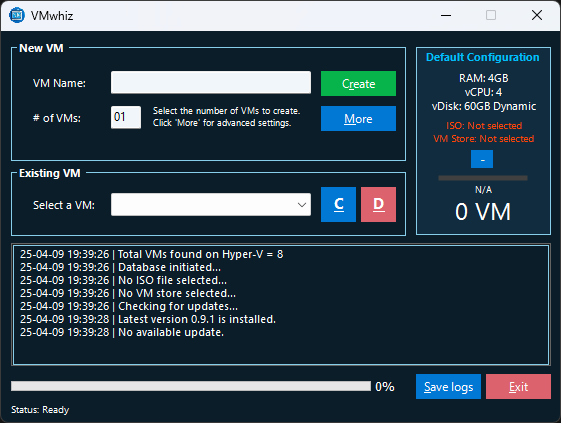
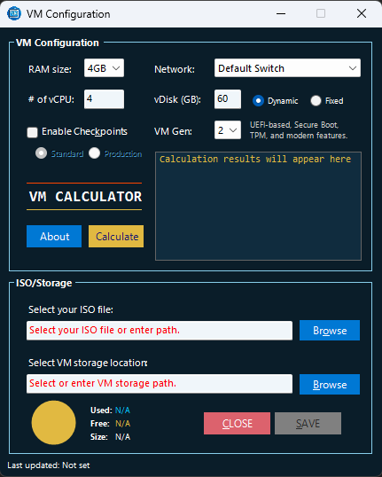

 

##

VMwhiz is a PowerShell-based graphical user interface (GUI) application designed to streamline the provisioning of Hyper-V virtual machines (VMs) on Windows platforms. 

Developed by Rabih HADDAD, VMwhiz provides an intuitive experience for IT experts and administrators to efficiently manage VM workflows.

- **Version**: 1.0 (pre-release 0.9.1)  
- **Release Date**: April 09, 2025  
- **Developer**: Rabih HADDAD  

##

## Overview

VMwhiz improves the provisioning of virtual machines within Microsoft Hyper-V environments. Its core functionalities include bulk VM deployment, efficient resource allocation, real-time operation monitoring, and robust integration with Microsoft Hyper-V.

## Features

### VM Provisioning
- Provision multiple VMs with customizable configurations in a single operation.
- Configure VM settings — including resource, storage, and network — prior to deployment.
- Delete VMs and automatically remove their associated file structure, with a dedicated maintenance task to manage files locked by Hyper-V for complete cleanup.

### Advanced Configuration
- Define VM properties such as RAM, vCPUs, disk size, disk type (Dynamic or Fixed), generation (1 or 2), network, and checkpoints through a dedicated settings dialog.

### Resource Insights
- The VM Calculator provides advanced functionality by analyzing available system resources to determine the optimal number of virtual machines (VMs) that can be effectively supported. It evaluates key metrics such as CPU, memory, and storage, delivering recommendations to ensure efficient resource utilization and maintain performance stability within virtualized environments.

### Prerequisite Validation
- Detect and prompt the user to install Hyper-V if not present.
- Ensure administrative privileges and compatible PowerShell/.NET Framework versions.

### Robust Logging
- In-depth activity and error logs saved to a file and the Windows Event Viewer.
- Export logs directly from the UI.

## Antivirus Consideration

The VMwhiz executable (`VMwhiz.exe`) may be flagged as potentially malicious by some antivirus software due to its automation capabilities and system-level interactions with Hyper-V. To mitigate this:

- **Windows Defender Integration**: During execution, VMwhiz will prompt the user to add `VMwhiz.exe` to the Windows Defender exclusion list, ensuring uninterrupted operation on systems using Microsoft’s built-in antivirus solution.  
- **Third-Party Antivirus**: For other antivirus programs (e.g., Norton, McAfee, or Kaspersky), manual intervention is required. You must add `VMwhiz.exe` to the exclusion or trusted applications list within the respective antivirus software to prevent false positives and ensure full functionality.

## User Interface

- **Modern Loading Experience**: Display a borderless loading screen with progress bars and status updates for a seamless startup.
- **Styled Controls**: Utilize custom GroupBox elements with refined border designs to enhance visual appeal.
- **Dynamic Feedback**: Deliver real-time UI updates during VM creation and management tasks, ensuring an interactive experience.

## System Requirements

- **Operating System**: Windows 10, Windows 11, or Windows Server (Hyper-V capable editions).  
- **PowerShell**: Version 5.0 or later.  
- **.NET Framework**: Version 4.5 or higher (optimized for 4.6.2).  
- **Hyper-V**: Enabled Hyper-V feature (installation offered if missing).  
- **Permissions**: Administrative rights required for Hyper-V management.  
- **Dependencies**:  
  - `System.Windows.Forms` and `System.Drawing` assemblies.  
  - Hyper-V PowerShell module.

## How to use VMwhiz:
1. **Start VMwhiz**:  
   - Launch the `.exe`. A loading screen validates prerequisites before displaying the main interface.  

2. **Main Interface**:  
   - **VM Name**: Specify a base name for new VMs (e.g., "TestVM").  
   - **Number of VMs**: Enter the desired quantity (1–99).  
   - **Create**: Initiates VM creation with sequential suffixes (e.g., "TestVM-01").  
   - **More**: Access advanced configuration options.  
   - **VM Dropdown**: Select existing VMs for connection or deletion.  
   - **Connect**: Starts and connects to the selected VM.  
   - **Delete**: Removes the selected VM and its resources.  
   - **Save Logs**: Exports the status log to a file.  
   - **Abort/Exit**: Cancels operations or exits the application.  

3. **More Settings**:  
   - Modify VM parameters: RAM, vCPU, vDiskSize, vDiskType, VM generation, checkpoints, vNetwork, ISO path, and storage location.  
   - Save settings for VM provisioning.  

4. **Monitoring**:  
   - Review real-time operation status in the GUI.  
   - Access detailed logs in `VMwhiz_LOG.log` or Event Viewer ("Application" log, source "VMwhiz").

## Github Directory Structure

- **Release**: Designated folder for the production-ready `VMwhiz.exe`.  
- **Archive**: Recommended for storing versioned builds (e.g., `Archive\1.0.1\`).  
- **ICONS**: Contains UI assets (`VMwhiz-Icon.ico`, `vmwhizlogo.png`).

## Configuration

- **Registry Storage**:  
  - Location: `HKCU:\Software\RHADDAD\Applications\VMwhiz\`.  
  - Keys: `Default` (baseline settings), `UserProfile` (user-specific settings).  
- **Log File and DB CSV**:  
  - `C:\Users\Username\AppData\Roaming\VMwhiz`  
- **Default Settings**:  
  - RAM: 4 GB, vCPUs: 4, Disk: 60 GB (Dynamic), Generation: 2, Network: "Default Switch".

### Steps for Manual Exclusion
1. Locate the `VMwhiz.exe` executable.  
2. Open your antivirus software settings or exclusions panel.  
3. Add the full path to `VMwhiz.exe` as an excluded or trusted file.  
4. Save changes and verify that VMwhiz operates without interference.

## Troubleshooting

- **Hyper-V Missing**: Confirm Hyper-V is enabled or allow VMwhiz to install it (requires reboot).  
- **Access Denied**: Run as Administrator.  
- **UI Unresponsive**: Review logs for errors.  
- **Icon Not Found**: Verify the `ICONS` folder is in the `.exe` directory.

## License

© 2025 Rabih HADDAD. All rights reserved.
