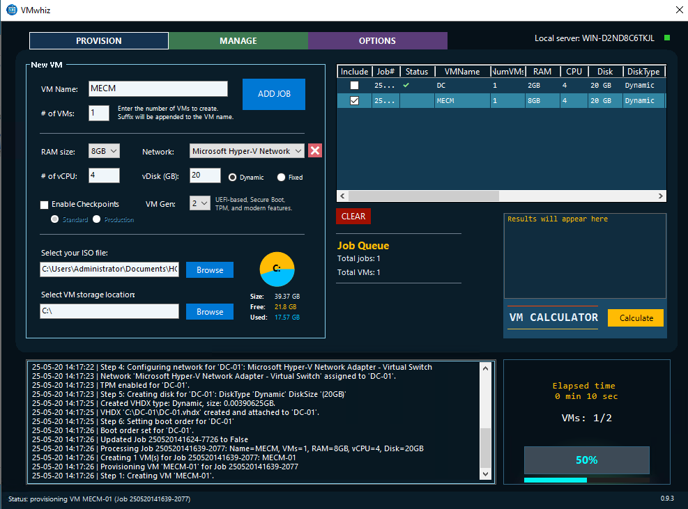
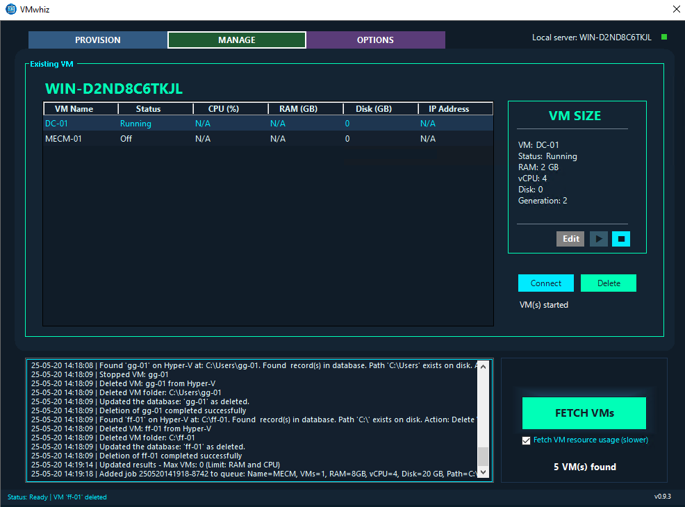

 
 ###### If you find this project helpful, consider supporting it with a donation via PayPal! 
 ##

  
  

##
## **Release notes**

**Update 0.9.3 – May 20, 2025**
-	Reworked: User interface has been extensively redesigned for a more modern, intuitive, and responsive experience, including improved layouts, dynamic theming, smoother animations, and clearer grouping of controls.
-	Added: Job queue system with improved Data Grid View styling, context menu for job deletion, and better status/warning indicators.
-	Added: Logic for auto-saving and auto-restoring user preferences (theme, paths, auto-update, etc.) in the Windows Registry.
-	Added: "Create New Network..." option in the network dropdown to allow creating new virtual networks directly from the UI.
-	Added: Delete button to remove selected virtual network switches from the dropdown.
-	Added: Theme engine that supports JSON-based code. Theme selection can be applied on the-fly without restarting the application.
-	Added: Hyper-V essential services panel with real-time status and start/stop controls for Hyper-V VMMS and Compute Service.
-	Added: Animated UI elements: Create/Build button now features smooth hover and click animations, with radiant circle glow effect.
-	Added: Auto-update timer and manual update button, with improved update/download logic and error handling.
-	Added: Host information panel with system, OS, Hyper-V, and VM statistics in a structured table format.
-	Added: Single-instance enforcement using a named mutex to prevent multiple app launches.
-	Improved: Maintenance job for background cleanup of locked fixed VHDX files after abort or deletion.
-	Improved: Abort/cleanup logic for VM provisioning, including better handling of in-progress and orphaned VMs.
-	Improved: Registry logic for configuration, paths, and versioning; now more robust and less error prone.
-	Improved: Error handling and logging throughout the script.
-	Improved: UI/UX: Modernized layout, added rounded corners, better grouping, and more informative tooltips.
-	Improved: Responsiveness and non-blocking UI during long operations (provisioning, fetching VMs, etc.).
-	Improved: Input validation for VM names, disk sizes, and network selections.
-	Improved: Status updates and progress indicators for all major operations.
- Improved: VM deletion logic to handle orphaned VMs and database records more reliably.
-	Improved: Disk space calculation and validation for fixed/dynamic disks.
-	Fixed: Multiple minor bugs related to registry access, theme switching, and job queue management.
-	Fixed: UI glitches and color inconsistencies across different themes and controls.
-	Fixed: Bugs in auto-update and version check logic, ensuring smoother update experience.
-	Fixed: Issues with disk space calculation and validation for fixed/dynamic disks.

##

**Update 0.9.2 - April 10, 2025**
- Fixed a bug installing Hyper-V feature on Windows server #11
- Fixed a bug where an error occurs when the application starts refreshing the dropdown list of existing VMs #12

##

  
**Update 0.9.1 - April 09, 2025**
- Fixed issue where the last selected VM was not retained after a refresh; now ensures reselection of the last chosen VM, defaulting to the first item if unavailable.
- Fixed path errors, removed GUI freezes, and improved VM startup reliability.
- Fixed syntax issues to ensure timers run without crashing.
- Implemented maintenance tasks to efficiently manage the cleanup of virtual machines and associated resources that are locked by Hyper-V after deletion operations.
- Implemented real-time updates for dropdowns, labels, and progress bars.
- Implemented version checking and update functionality with registry tracking.
- Improved form layouts, added tooltips, and updated labels for better user experience.
- Improved GUI Responsiveness: Eliminated blocking delays by relying on asynchronous state checks.
- Improved input validation for VM names, paths, and configurations.
- Improved code logic to save and retrieve configurations, including disk type, checkpoints, and VM paths.
- Improved logging and error messages for better debugging.
- Improved VM calculator logic for accurate resource estimation.
- Reworked functions for better readability and reusability.

© 2025 Rabih HADDAD. All rights reserved.

